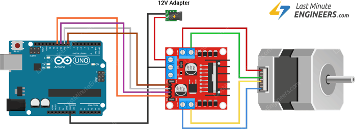
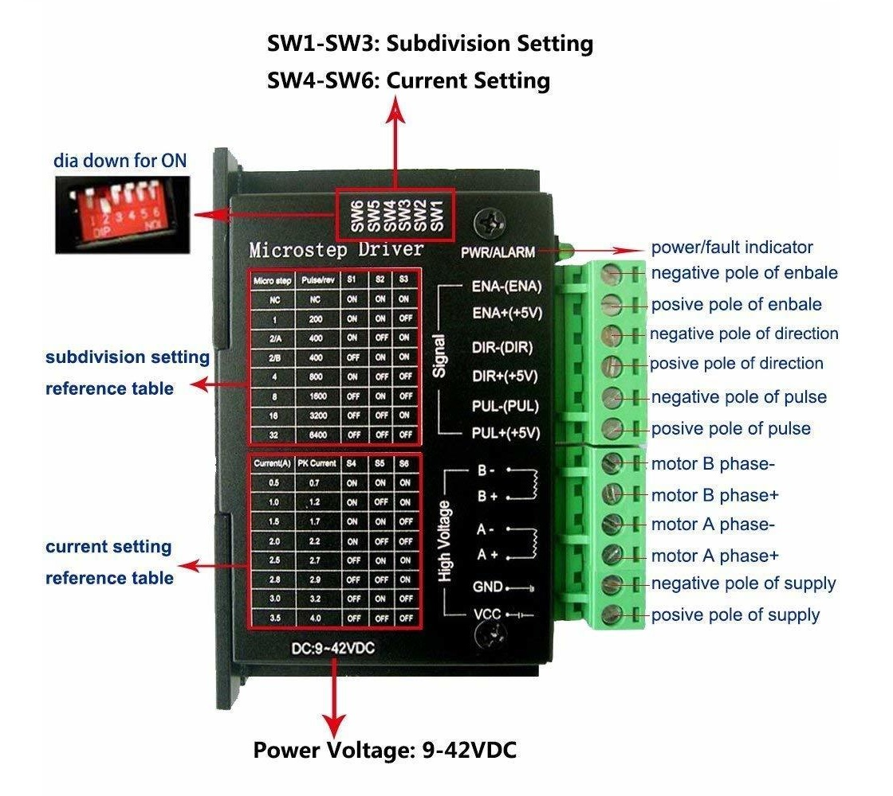
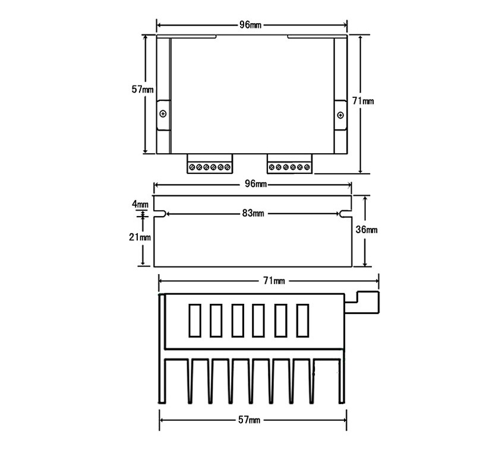
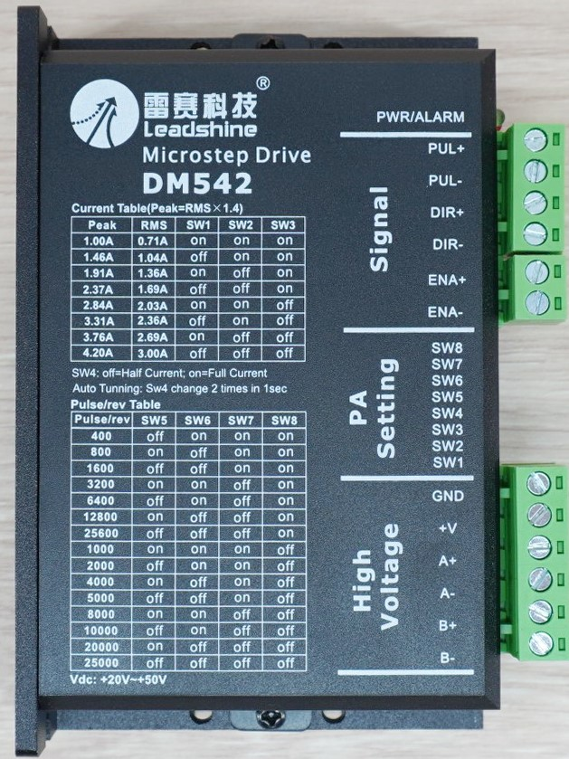
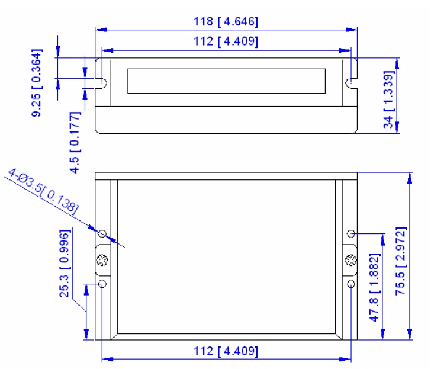

# Stepper Motor Control
<!-- Comments -->
## L298N Step Motor driver (H-Bridge Driver)
****
<!-- Image embedded -->
  

[L298N Motor Driver Module](https://www.zonemaker.com/product/203/l298n-motor-driver-module)  

### Specification
- Driver chip : L298N dual H-bridge driver chip
- Terminal driver part of the supply area VMS : +5 V ~ +35 V
- Drive part of the peak current Io : 2A / Bridge
- Logical part of the terminal power supply range Vss : 4.5-5 .5 V
- Logical part of the operating current range : 0 ~ 36mA
- The control signal input voltage range : 4.5-5.5V low 0V high
- Maximum power consumption : 20W
- Storage temperature : -25 ~ +130
- Driver Board Size : 55mm * 60mm * 30mm
- Driver board Weight : 33g
- Other features : control direction indicator, power indicator, current detection, logical part of the plate to take power interface.

### Reference 
[Control Stepper Motor with L298N Motor Driver & Arduino](https://lastminuteengineers.com/stepper-motor-l298n-arduino-tutorial/)

### Driver Pinout
| Pin # | Pin name  | Description                                                      |
| ----- | --------- | ---------------------------------------------------------------- |
| 1     | VS (+12V) | Power Supply Input Positive /5V to 12V (Operating Voltage)       |
| 2     | GND       | common ground pin                                                |
| 3     | VSS (+5V) | drive the logic circuitry, which can be 5 to 7V)                 |
| 4     | ENA       | Enable/Disable motor indepently of the input signals (IN1, IN2)  |
| 5     | IN1       | Control pins, speed and spinning direction of the stepper motor. |
| 6     | IN2       | Control pins, speed and spinning direction of the stepper motor. |
| 7     | IN3       | Control pins, speed and spinning direction of the stepper motor. |
| 8     | IN4       | Control pins, speed and spinning direction of the stepper motor. |
| 9     | ENB       | Enable/Disable motor indepently of the input signals (IN3, IN4)  |
| 10    | OUT1      | motor driver’s output can connect any 12-24V                     |
| 11    | OUT2      | motor driver’s output can connect any 12-24V                     |
| 12    | OUT3      | motor driver’s output can connect any 12-24V                     |
| 12    | OUT4      | motor driver’s output can connect any 12-24V                     |

****
### Simple Stepper Wiring diagram
<!-- Product Drawing -->

****

## TB6600  Microstep driver 
****

<!-- Embedded Image -->
<!-- 1 -->
<!--    -->

<!-- 2 -->
<!--  -->

<!-- 3 -->
<!--  -->

<!-- 4 -->
<!--  -->

<!-- 5 -->
  

<!-- 6 -->
<!--  -->
<!-- End -->  

[TB6600 Microstep Driver Peak 4A, 9-42 VDC 2-Phase](https://www.zonemaker.com/product/154/tb6600-microstep-driver-peak-4a-9-42-vdc-ic-tb67s109aftg-2-phase)  

### Features
- single chip bipolar sine microstep stepper motor driver
- the new BiCD 0.13 nm process
- up to 42V
- resistance (a +) = 0.4.
- the forward and reverse rotation control
- 5 subdivision mode options (1/1, 1/2, 1/4, 1/8, 1/16,1/32)
- output current: IOUT = 4.0A (peak, in 100ms)
- rated output: IOUT = 3.5 A
- package: HZIP25 - 1.00F
- input port internal pull-down resistor: 100 K.
- alarm output pin current:Ialert = 1mA
- monitoring output pin (MO): Imo= 1mA
- with reset and enable pin
- with standby function.
- Break through the traditional, single power supply
- built in overheating protection (TSD) circuit
- Undervoltage protection, built-in (UVLO) circuit
- built-in overcurrent detection (ISD), circui

### Reference 
https://www.youtube.com/watch?v=KjKAvuVojoQ&ab_channel=EEMisadventures  
https://www.youtube.com/watch?v=VrhJoc_XkrU&ab_channel=MundoC.N.C.conArduino  

### Microstep Resolution settings
| Microstep | Pulse/Revolution |  SW1  |  SW2  |  SW3  |
| --------- | ---------------- | :---: | :---: | :---: |
| NC        | NC               |  ON   |  ON   |  ON   |
| 1         | 200              |  ON   |  ON   |  OFF  |
| 2/A       | 400              |  ON   |  OFF  |  ON   |
| 2/B       | 400              |  OFF  |  ON   |  ON   |
| 4         | 800              |  ON   |  OFF  |  OFF  |
| 8         | 1600             |  OFF  |  ON   |  OFF  |
| 16        | 3200             |  OFF  |  OFF  |  ON   |
| 32        | 6400             |  OFF  |  OFF  |  OFF  |

### Current settings
| Current(A) | Peak Current(A) |  SW4  |  SW5  |  SW6  |
| ---------- | --------------- | :---: | :---: | :---: |
| 0.5        | 0.7             |  ON   |  ON   |  ON   |
| 1.0        | 1.2             |  ON   |  OFF  |  ON   |
| 1.5        | 1.7             |  ON   |  ON   |  OFF  |
| 2.0        | 2.2             |  ON   |  OFF  |  OFF  |
| 2.5        | 2.7             |  OFF  |  ON   |  ON   |
| 2.8        | 2.9             |  OFF  |  OFF  |  ON   |
| 3.0        | 3.2             |  OFF  |  ON   |  OFF  |
| 3.5        | 4.0             |  OFF  |  OFF  |  OFF  |

### Driver Pinout
| Pin # | Pin name   | Description                                                 |
| ----- | ---------- | ----------------------------------------------------------- |
| 1     | ENA- (ENA) | Direction Input Cathode of Optoisolator                     |
| 2     | ENA+ (+5V) | Direction Input Anode of Optoisolator                       |
| 3     | DIR- (DIR) | Pulse Input Cathode of Optoisolator                         |
| 4     | DIR+ (+5V) | Pulse Input Anode of Optoisolator                           |
| 5     | PUL- (PUL) | Enable Input Cathode of Optoisolator                        |
| 6     | PUL+ (+5v) | Enable Input Anode of Optoisolator                          |
| 7     | B-         | Stepper Motor Output Winding B Negative                     |
| 8     | B+         | Stepper Motor Output Winding B Positive                     |
| 9     | A-         | Stepper Motor Output Winding A Negative                     |
| 10    | A+         | Stepper Motor Output Winding A Positive                     |
| 11    | GND        | Power Supply Input Negative / 0V                            |
| 12    | VCC        | Power Supply Input Positive /9V to +40V (Operating Voltage) |

****
### Product Drawing
<!-- Product Drawing -->

****

## DM542 Microstep Driver 

<!-- Product Image -->
  

[DM542 (Leadshine) Microstep Driver Peak 4.2A, 20-50 VDC 2-Phase](https://www.zonemaker.com/product/1348/dm542-leadshine-microstep-driver-peak-4-2a-20-50-vdc-2-phase-2) 

### Introduction
****
DM542 digital low-voltage stepper motor drive, using the latest 32-bit DSP technology, suitable for driving 57,86 series motor, with excellent low-speed performance to meet the application needs of most small and medium sized equipment.
With built-in micro-segmentation technology, even at low breakdown conditions, but also to achieve high breakdown effect, low-speed operation is very smooth, minimal noise.
Drive internal integration parameter self-tuning feature that can automatically generate the optimal operating parameters for different motors to maximize the performance of the motor.

### Features
- Can drive four lines, 8 lines of two-phase stepper motor
- Voltage input range: 18 ~ 48 VDC
- Current Max: 4.2A, Resolution: 0.1A
- Subdivision range: 400 ~ 25600ppr
- Signal Input: Differential / Single-Ended, pulse / direction or double pulse, 5 ~ 24VDC level compatible
- Impulse Response Frequency: 200KHz
- Built-in micro-segmentation
- The electrical parameters of the automatic tuning function
- Precision current control of the motor heat is greatly reduced
- Stationary current is automatically reduced by half
- Optically isolated inputs, strong anti-jamming capability
- Overvoltage, overcurrent protection function

### Specifications
* Power supply:DC 24-60 (V)  
Current maximum:4.5A  
Output phase current:1.5A-4.5A  
Logic input current:10-20mA  
Operating temperature:-15°—+45°  
Size:11.7*8.5cm/4.61*3.35inch  

### Ref
[link0](https://www.zonemaker.com/product/1348/dm542-leadshine-microstep-driver-peak-4-2a-20-50-vdc-2-phase-2)  
[link1](https://www.dfrobot.com/product-1547.html)  
[DFROBOT-TB6600 Wiki](https://wiki.dfrobot.com/TB6600_Stepper_Motor_Driver_SKU__DRI0043)  

### Current settings
| Peak Current(A) | RMS Current(A) |  SW1  |  SW2  |  SW3  |
| --------------- | -------------- | :---: | :---: | :---: |
| 1.00            | 0.71           |  ON   |  ON   |  ON   |
| 1.46            | 1.04           |  OFF  |  ON   |  ON   |
| 1.91            | 1.36           |  ON   |  OFF  |  ON   |
| 2.37            | 1.69           |  OFF  |  OFF  |  ON   |
| 2.84            | 2.03           |  ON   |  ON   |  OFF  |
| 3.31            | 2.36           |  OFF  |  ON   |  OFF  |
| 3.76            | 2.69           |  ON   |  OFF  |  OFF  |
| 4.20            | 3.00           |  OFF  |  OFF  |  OFF  |

### Microstep Resolution settings
| Microstep | Pulse/Rev (for 1.8° Motor) |  SW5  |  SW6  |  SW7  |  SW8  |
| --------- | -------------------------- | :---: | :---: | :---: | :---: |
| 2         | 400                        |  OFF  |  ON   |  ON   |  ON   |
| 4         | 800                        |  ON   |  OFF  |  ON   |  ON   |
| 8         | 1600                       |  OFF  |  OFF  |  ON   |  ON   |
| 16        | 3200                       |  ON   |  ON   |  OFF  |  ON   |
| 32        | 6400                       |  OFF  |  ON   |  OFF  |  ON   |
| 64        | 12800                      |  ON   |  OFF  |  OFF  |  ON   |
| 128       | 25600                      |  OFF  |  OFF  |  OFF  |  ON   |
| 5         | 1000                       |  ON   |  ON   |  ON   |  OFF  |
| 10        | 2000                       |  OFF  |  ON   |  ON   |  OFF  |
| 20        | 4000                       |  ON   |  OFF  |  ON   |  OFF  |
| 25        | 5000                       |  OFF  |  OFF  |  ON   |  OFF  |
| 40        | 8000                       |  ON   |  ON   |  OFF  |  OFF  |
| 50        | 10000                      |  OFF  |  ON   |  OFF  |  OFF  |
| 100       | 20000                      |  ON   |  OFF  |  OFF  |  OFF  |
| 125       | 25000                      |  OFF  |  OFF  |  OFF  |  OFF  |

### Driver Pinout
| Pin # | Pin name | Description                                                 |
| ----- | -------- | ----------------------------------------------------------- |
| 1     | PUL+     | Pulse Input Anode of Optoisolator                           |
| 2     | PUL-     | Pulse Input Cathode of Optoisolator                         |
| 3     | DIR+     | Direction Input Anode of Optoisolator                       |
| 4     | DIR-     | Direction Input Cathode of Optoisolator                     |
| 5     | ENA+     | Enable Input Anode of Optoisolator                          |
| 6     | ENA-     | Enable Input Cathode of Optoisolator                        |
| 7     | GND      | Power Supply Input Negative / 0V                            |
| 8     | V+       | Power Supply Input Positive /9V to +40V (Operating Voltage) |
| 9     | A+       | Stepper Motor Output Winding A Positive                     |
| 10    | A-       | Stepper Motor Output Winding A Negative                     |
| 11    | B+       | Stepper Motor Output Winding B Positive                     |
| 12    | B-       | Stepper Motor Output Winding B Negative                     |

****
### Product Drawing
<!-- Product Drawing -->

****
## MOONS SR2 Plus
****

### Ref
[link1](https://www.moonsindustries.com/p/sr-series-two-phase-dc-stepper-motor-drives/sr2-plus-000004696351001983)

